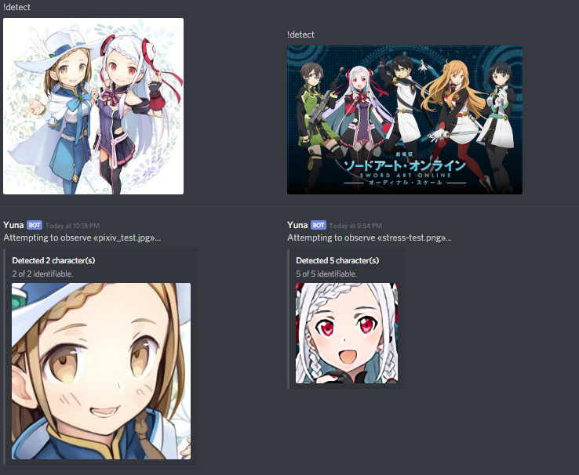

# Yuna
A Flask server that performs facial recognition using deep learning, powered by
TensorFlow. Comes packaged with a Discord bot.

## Development
Due to filesize limitations of GitHub, please run `make defrag-model` after cloning
to recombine the trained model. Run `make frag-model` to undo this.
Specify `YUNA_TOKEN` inside a `.env` file for the Discord bot.
Flask server wraps TensorFlow with an API hosted on port `5000`.
`docker-compose up -d` to start, `docker-compose down --rmi local` to stop and clean up.
